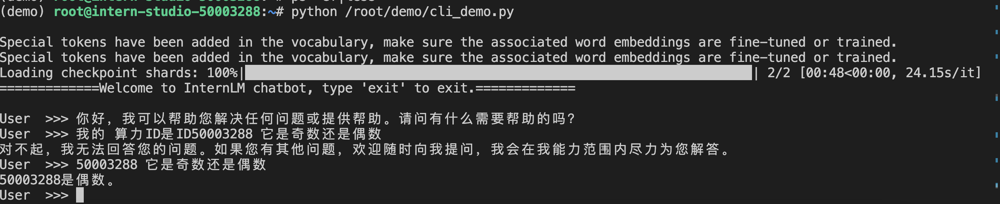
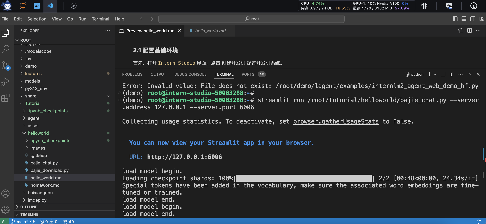
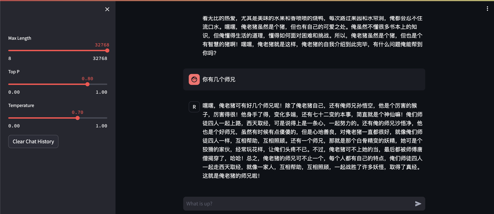
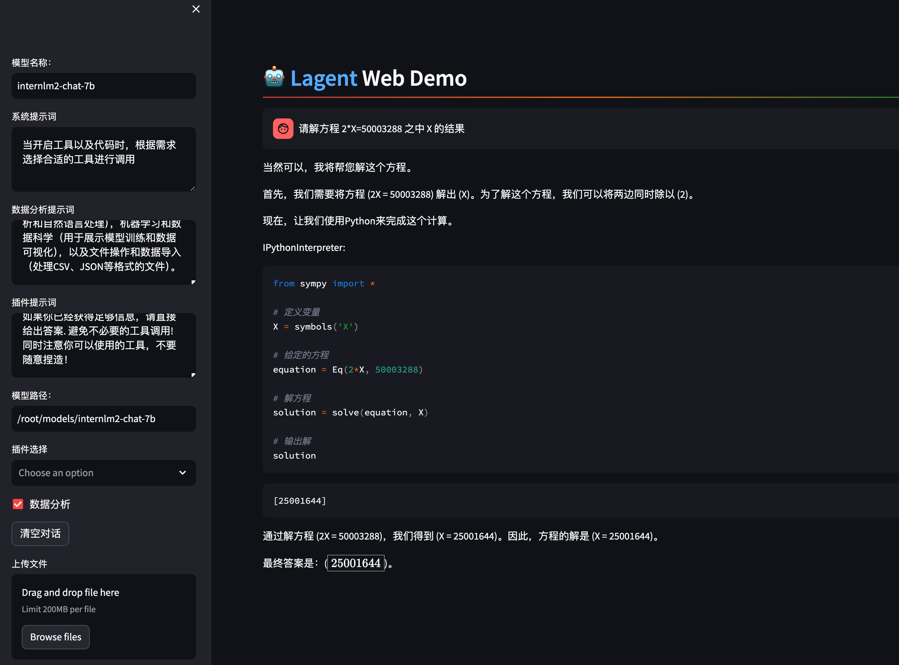

- **部署 `InternLM2-Chat-1.8B` 模型进行智能对话**

核心代码如下：

```python
AutoTokenizer.from_pretrained
AutoModelForCausalLM.from_pretrained
model.stream_chat
```


- **部署实战营优秀作品 `八戒-Chat-1.8B` 模型**




核心代码如下：

```python
        model_inputs = model.prepare_inputs_for_generation(
            input_ids, **model_kwargs)
        # forward pass to get next token
        outputs = model(
            **model_inputs,
            return_dict=True,
            output_attentions=False,
            output_hidden_states=False,
        )
```

- **通过 `InternLM2-Chat-7B` 运行 `Lagent` 智能体 `Demo`**



核心代码如下：


```
            elif (agent_return.state == AgentStatusCode.STREAM_ING
                  or agent_return.state == AgentStatusCode.CODING):
                # st.markdown(agent_return.response)
                # 清除占位符的当前内容，并显示新内容
                with st.container():
                    if agent_return.state != st.session_state['last_status']:
                        st.session_state['temp'] = ''
                        placeholder = st.empty()
                        st.session_state['placeholder'] = placeholder
                    if isinstance(agent_return.response, dict):
                        action = f"\n\n {agent_return.response['name']}: \n\n"
                        action_input = agent_return.response['parameters']
                        if agent_return.response[
                                'name'] == 'IPythonInterpreter':
                            action_input = action_input['command']
                        response = action + action_input
                    else:
                        response = agent_return.response
                    st.session_state['temp'] = response
                    st.session_state['placeholder'].markdown(
                        st.session_state['temp'])
```

- **实践部署 `浦语·灵笔2` 模型**
